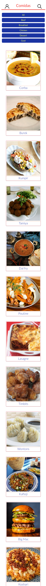

<h1 align="center">Recipes-App</h1>

<p align="center">Olá, seja bem vindo(a) ao projeto Recipes-App. <br>
Esse projeto foi o último projeto desenvolvido em grupo durante o curso da Trybe no módulo de Front-end, utilizando
 <a href="https://pt-br.reactjs.org/"> React</a>, <a href="https://pt-br.reactjs.org/docs/context.html">Context API</a> e Hooks <a href="https://pt-br.reactjs.org/docs/hooks-intro.html"></a></p>
 
 <p align="center">
  <a href="#bookmark-sobre">Sobre</a>&nbsp;&nbsp;&nbsp;|&nbsp;&nbsp;&nbsp;
  <a href="#rocket-tecnologias">Tecnologias</a>&nbsp;&nbsp;&nbsp;|&nbsp;&nbsp;&nbsp;
  <a href="#hammer_and_wrench-features">Features</a>&nbsp;&nbsp;&nbsp;|&nbsp;&nbsp;&nbsp;
  <a href="#cloud-apis">APIs</a>&nbsp;&nbsp;&nbsp;|&nbsp;&nbsp;&nbsp;
  <a href="#notebook-instalação">Instalação</a>&nbsp;&nbsp;&nbsp;|&nbsp;&nbsp;&nbsp;
  <a href="#eyes-demonstração">Demonstração</a>&nbsp;&nbsp;&nbsp;|&nbsp;&nbsp;&nbsp;
  <a href="#technologist-integrantes">Integrantes</a>&nbsp;&nbsp;&nbsp;|&nbsp;&nbsp;&nbsp;
</p>

<h2>:bookmark: Sobre</h2>
<p>
Este projeto aborda o desenvolvimento de um aplicativo de receitas, o qual será possível ver, buscar, filtrar, favoritar e acompanhar o processo de preparação de receitas e drinks! O layout também foi produzido pensando em mobile-first, ou seja, a tela está responsiva para quem utilizar em dispositivos móveis.
</p>

<h2>:rocket: Tecnologias</h2>
 
 As seguintes ferramentas foram usadas na construção do projeto:
 
-  [React](https://pt-br.reactjs.org/)
-  [Context API](https://pt-br.reactjs.org/docs/context.html)
-  [Hooks](https://pt-br.reactjs.org/docs/hooks-intro.html)

<h2>:cloud: APIs</h2>

- [Meals](https://www.themealdb.com/api.php)
- [Cocktails](https://www.thecocktaildb.com/api.php)
- [Hooks](https://pt-br.reactjs.org/docs/hooks-intro.html)

<h2>:hammer_and_wrench: Features</h2>

- [x] O usuário poderá logar no joga, e caso o email tiver cadastro no site Gravatar, ter sua foto associada ao perfil de usuária.
- [x] O usuário poderá pesquisar e filtrar por comidas.
- [x] O usuário poderá pesquisar e filtrar por bebidas.
- [x] O usuário poderá favoritar por uma comida, e salvar a comida na página de receitas favoritas.
- [x] O usuário poderá favoritar por uma bebida, e salvar a bebida na página de receitas favoritas.
- [x] O usuário poderá acessar a página de detalhes de uma receita.
- [x] O usuário poderá iniciar uma receita, e marcar o andamento da mesma, e ao finalizar, a receita deverá ser encontrada na página receitas finalizadas.
- [x] O usuário terá acesso a sua página de perfil.

<h2>:notebook: Instalação</h2>
<h3>Pré-requisitos</h3>

Antes de começar, você vai precisar ter instalado em sua máquina as seguintes ferramentas:

**Node**: [Download Node.js](https://nodejs.org/en/download/)

**Git**: [Download Git](https://git-scm.com/downloads)

 <h3>Rodando a aplicação</h3>
 
 ```bash
 # Clone este repositório
$ git clone  <https://github.com/Zeonnatios/recipes-app>

# Acesse a pasta do projeto no terminal/cmd

$ cd recipes-app/

# Instale as dependências

$ npm install

# Execute a aplicação

$ npm start

# O servidor inciará na porta:3000 - acesse <http://localhost:3000>

```
 <h2>:eyes: Demonstração</h2>





<h2>:technologist: Integrantes</h2>

<table>
  <tr>
    <td align="center"><a href="https://github.com/Zeonnatios">
      
      <br /><sub><b>Matheus Antonio</b></sub></a><br /><a href="https://github.com/Zeonnatios" title="GitHub Matheus Antonio">🚀</a>
    </td>
    <td align="center"><a href="https://github.com/heyynat">
      
      <br /><sub><b>Natali Lima</b></sub></a><br /><a href="https://github.com/heyynat" title="GitHub Natali Lima">🚀</a>
    </td>
   </tr>
   <tr>
    <td align="center"><a href="https://github.com/LauraGusmao">
      
      <br /><sub><b>Laura Gusmão</b></sub></a><br /><a href="https://github.com/LauraGusmao" title="GitHub Laura Gusmão">🚀</a>
    </td>
    <td align="center"><a href="https://github.com/Naitwa-Alexandre">
      
      <br /><sub><b>Alexandre Pereira</b></sub></a><br /><a href="https://github.com/Naitwa-Alexandre" title="GitHub Alexandre pereira">🚀</a>
    </td>

   </tr>

</table>
